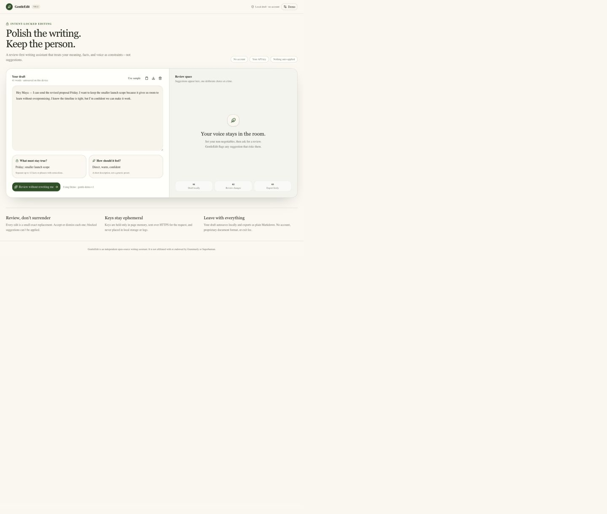
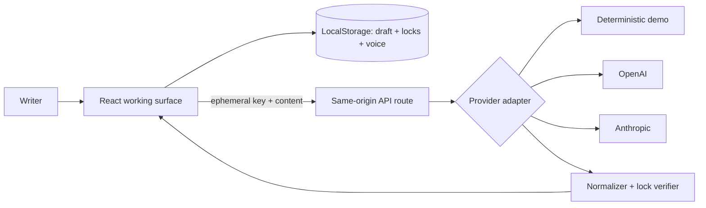

# GentleEdit


**A local-first, review-first writing assistant that protects the facts and voice you name.**

GentleEdit is an independent open-source alternative for people who find that paid writing assistants can overreach, change meaning, or flatten voice. It does one narrow job: propose small, inspectable edits while treating your non-negotiables as locks.

> Status: v0.1.0. The core workflow is usable; cloud-provider behavior remains dependent on each user’s key, model access, pricing, and policies.

## Why this exists

Across independent 2024–2025 user discussions, writers repeatedly report suggestions that change context, remove voice, or create correction loops ([source 1](https://www.reddit.com/r/Grammarly/comments/1fpzrqc/grammarly_suggestions_are_getting_bad/), [source 2](https://www.reddit.com/r/Grammarly/comments/1jbdsg0/is_grammarly_going_down_hill/), [source 3](https://www.reddit.com/r/Grammarly/comments/1j38chq/what_the_hell_is_going_on_with_grammarly/)). Grammarly Pro’s official US list price is $144/year ([pricing](https://support.grammarly.com/hc/en-us/articles/115000090011-How-much-does-Grammarly-Pro-cost)). GentleEdit does not claim to be universally better. It is designed to be better for a narrower group: writers who need every commitment, fact, and tone-sensitive change to remain auditable.

The evaluation found that all affected intent locks in the fixture set were either preserved or caused the edit to be blocked, and that zero changes applied without an explicit writer action. See [methodology and raw results](docs/comparative-evaluation.md).

## What it does

- Writer-defined fact/phrase locks, checked inside every touched snippet.
- Exact before/after suggestions; no opaque full-draft replacement.
- One-at-a-time accept or dismiss; no bulk accept.
- No-key deterministic demo for evaluation, onboarding, and offline use.
- OpenAI and Anthropic BYOK adapters with provider/model selection.
- Masked ephemeral keys, connection checks, timeouts, and useful provider errors.
- Local draft/lock/voice autosave, clipboard copy, and complete Markdown export.
- No application account, analytics, tracking, or maintainer-funded API.
- Responsive and keyboard-accessible working surface.



## Quick start

Requires Node.js 22.13 or later.

```bash
git clone https://github.com/Satwik-P28/gentleedit.git
cd gentleedit
npm ci
npm run dev
```

Open `http://localhost:3000`. Demo mode needs no key or network provider.

### Docker

```bash
docker build -t gentleedit .
docker run --rm -p 3000:3000 gentleedit
```

## Bring your own key

Open **Demo** / **Provider** in the header, select OpenAI or Anthropic, choose a model available to your provider account, enter the key, and use **Test connection**. The key stays in page memory and disappears on refresh, tab close, or provider change.

Self-hosters may instead copy `.env.example` to `.env.local` and set `OPENAI_API_KEY` or `ANTHROPIC_API_KEY`. Never commit that file.

| Provider  | Default model             | Limitations                                                                             |
| --------- | ------------------------- | --------------------------------------------------------------------------------------- |
| Demo      | `gentle-demo-v1`          | No key/network; deterministic and intentionally limited to a few safe transforms        |
| OpenAI    | `gpt-4.1-mini`            | Requires user key, billing, model access; request content is subject to OpenAI terms    |
| Anthropic | `claude-3-5-haiku-latest` | Requires user key, billing, model access; request content is subject to Anthropic terms |

Model identifiers change. Enter another model in settings when a provider retires a default.

## Architecture



UI state, domain rules, API routes, and provider translation are separate. See the [product specification](docs/product-spec.md) for the data model and full requirements.

## Privacy and security

Draft, locks, and voice stay in origin-scoped local storage until the user clears site data. A key typed into the UI is held only in page memory, sent to the same-origin route for the active request, forwarded over HTTPS to the chosen provider, and neither persisted nor intentionally logged. API responses use `Cache-Control: no-store`.

Using a cloud provider necessarily sends the submitted draft, constraints, model name, and key to the self-hosted/hosted route and sends the draft/constraints to that provider. Provider-side retention and training rules are governed by the provider and the user’s account agreement. For maximum privacy, use Demo mode; it makes no external provider request.

Report vulnerabilities privately as described in [SECURITY.md](SECURITY.md).

## Testing

```bash
npm run check
```

This runs strict type checking, lint, formatting verification, unit/integration/journey/accessibility tests, and the production build. Research evidence, comparative evaluation, commands, results, and limitations live in [`docs/`](docs/).

## Current limitations

- Intent locks are literal case-insensitive phrase checks, not a proof of semantic equivalence.
- The demo reviewer is intentionally narrow and English-focused.
- Suggestions do not stream, undo history is browser-session-only, and only one local draft is stored.
- Cloud adapters are implemented and mocked/tested without real keys; no maintainer key is used in CI.
- This is a focused editor, not a browser extension or system-wide checker.

## Roadmap

- OpenRouter and local Ollama adapters.
- Reusable style guides and lock sets.
- Explicitly encrypted multi-draft history.
- Advisory semantic-drift scoring.
- `.txt` / `.docx` import after a file-security review.

## Contributing

Small, test-backed improvements are welcome. Read [CONTRIBUTING.md](CONTRIBUTING.md), the [Code of Conduct](CODE_OF_CONDUCT.md), and the [Security Policy](SECURITY.md). Good first contributions include new deterministic demo rules, provider adapters, accessibility tests, and evaluation fixtures.

## License and independence

[MIT](LICENSE). GentleEdit is an independent open-source writing assistant. It is not affiliated with, endorsed by, or sponsored by Grammarly, Superhuman, OpenAI, or Anthropic. Product and company names belong to their respective owners and are used only for accurate identification and comparison.

## Acknowledgements

Built with React, Vinext, Tailwind CSS, shadcn components, Lucide icons, Vitest, and the public APIs of user-selected AI providers. Thank you to writers who document real-world failure modes in public; those reports shaped the narrow consent-first thesis without supplying any proprietary assets or code.
