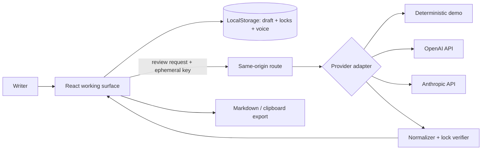

# Clausefully product specification

## Product

**Target users:** people polishing consequential everyday writing—client emails, job applications, school messages, proposals, and sensitive team communication—who want help without surrendering intent or voice.

**One sentence:** Clausefully is a local-first, review-first writing assistant that proposes small edits while enforcing writer-defined facts and voice constraints.

**Differentiation thesis:** For writers of consequential everyday messages, paid writing assistants can propose edits that alter documented meaning or voice; Clausefully improves the experience with intent locks, exact-substring proposals, automatic lock checks, and one-at-a-time consent, measured by 100% preservation-or-blocking of affected locks and zero automatic edits.

## Primary journey

1. Arrive without creating an account and understand the three-step model.
2. Write/paste a draft or use the realistic sample.
3. Enter semicolon-separated facts or phrases that must not change and describe the intended voice.
4. Use the deterministic demo or select OpenAI/Anthropic, enter a masked key, and test the connection.
5. Request a review; see loading, success, empty, and actionable error states.
6. Inspect exact before/after snippets and explanations. Accept or dismiss one suggestion. A lock-breaking suggestion is visibly blocked.
7. Continue editing, copy the draft, or export complete Markdown.

## MVP scope

- Browser-based single-draft editor with local autosave.
- Up to 20,000 characters and 12 intent locks.
- Writer-authored voice description.
- Demo, OpenAI, and Anthropic provider adapters.
- Ephemeral masked API key, connection check, clear provider errors, and server environment variables.
- Exact-substring suggestions with lock enforcement.
- Individual accept/dismiss; no bulk accept.
- Markdown export and clipboard copy.
- Responsive, keyboard-accessible first-run experience.

## Non-goals

- Browser extension, operating-system-wide overlay, real-time keystroke monitoring, team collaboration, document history, plagiarism/AI detection, authorship claims, academic grading, automated sending, or perfect semantic-equivalence proof.
- Storing provider keys or subsidizing inference.
- Replicating a competitor interface, brand, proprietary assets, integrations, or private APIs.

## Functional requirements

- A review request is rejected when the draft is empty or over 20,000 characters.
- Provider output must be valid JSON and every suggestion’s `original` must be an exact draft substring.
- A lock located inside the original snippet must occur in the replacement; otherwise the suggestion is `blocked` and cannot be applied.
- Applying stale suggestions fails safely after the draft changes.
- The demo provider must be deterministic and network-free.
- Connection checks distinguish authentication, quota/rate limit, provider outage, model/configuration, and timeout conditions where the provider response allows it.

## Privacy and security

- Draft, locks, and voice persist only in origin-scoped browser local storage.
- Entered API keys live only in React memory and are cleared by refresh/tab close/provider change.
- The same-origin API receives a supplied key only for the active request, does not log or persist it, returns `Cache-Control: no-store`, and forwards it over TLS to the selected provider.
- Self-hosters may provide `OPENAI_API_KEY` or `ANTHROPIC_API_KEY`; `.env*` remains ignored while `.env.example` contains placeholders only.
- No analytics, trackers, cookies, application accounts, or maintainer keys.
- Content sent to a cloud provider is governed by that provider’s terms and retention policy; the UI and README state this limitation.

## Accessibility

- Semantic headings, regions, labels, buttons, status/alert live regions, skip link, and native form controls.
- Fully keyboard-operable workflow and visible focus treatment.
- Text and controls meet WCAG AA contrast in the primary theme; state is never communicated by color alone.
- Motion is limited to a loading rotation and respects the browser’s reduced-motion behavior through the utility framework.

## Responsive design

- Single-column editor/review flow below desktop breakpoints; two-pane comparison above.
- Touch targets remain usable at 320px width; tool labels collapse only when their icon retains an accessible name.
- No horizontal page scrolling at 320, 768, or 1440 CSS pixels.

## Architecture and data model

Core types are `ReviewRequest`, `ReviewResult`, `Suggestion`, and `ProviderId`. Interface code owns transient interaction state; domain functions own parsing, validation, lock checks, and exact replacements; API routes own request validation; provider adapters own external request/response translation.

## Supported providers

- **Demo:** no key/network; deliberately limited deterministic transforms for onboarding and tests.
- **OpenAI:** Chat Completions-compatible request, JSON object response mode, default `gpt-4.1-mini`; model availability and billing depend on the user’s account.
- **Anthropic:** Messages API, default `claude-3-5-haiku-latest`; model availability and billing depend on the user’s account.

## Testing and comparative validation

- Unit: lock parsing/checking, exact replacement, stale edit refusal, provider normalization/blocking.
- Integration: same-origin review endpoint and no-key demo adapter.
- End-to-end component journey: request, render, explain, accept, and error recovery.
- Comparative fixture: evaluate lock preservation/blocking, exact-substring scope, explicit-apply behavior, export completeness, and no-key demo completion.
- Static checks, production build, dependency audit, secret scan, clean install, responsive browser inspection, accessibility tree/keyboard pass, and smoke request.

## Definition of done

The primary journey works in demo mode; both BYOK adapters and connection checks are implemented; all checks pass; required states and responsive layouts are inspected; docs and open-source governance files exist; no secret is found; evidence-backed claims are limited to the evaluated advantage; public repository and initial release are published.

## Roadmap

1. Provider-independent streaming and OpenRouter/Ollama adapters.
2. Client-side encrypted project history with explicit opt-in.
3. User-editable style guide and reusable lock sets.
4. Sentence-level semantic similarity as an advisory signal—not an automatic truth oracle.
5. Import/export for `.txt` and `.docx`, followed by a browser extension only after a separate permission/security review.
